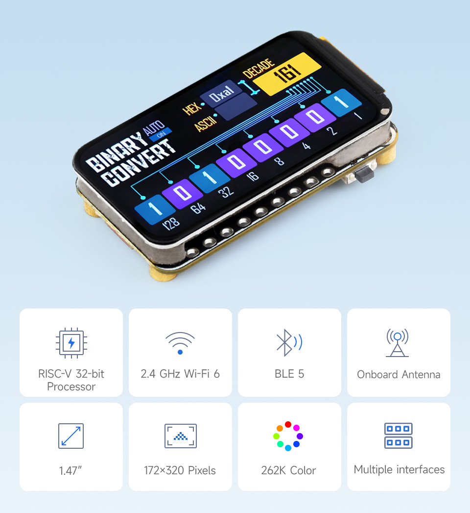
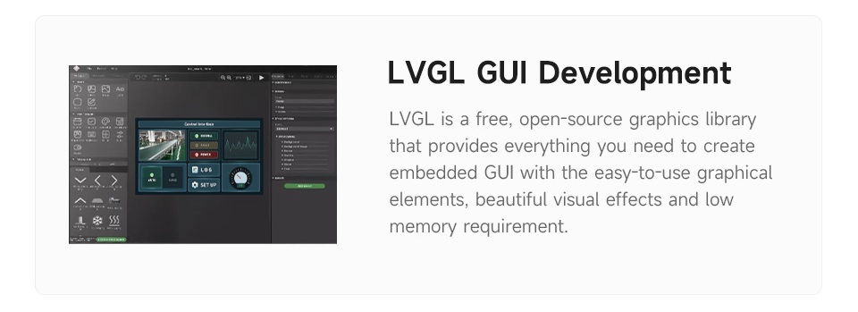
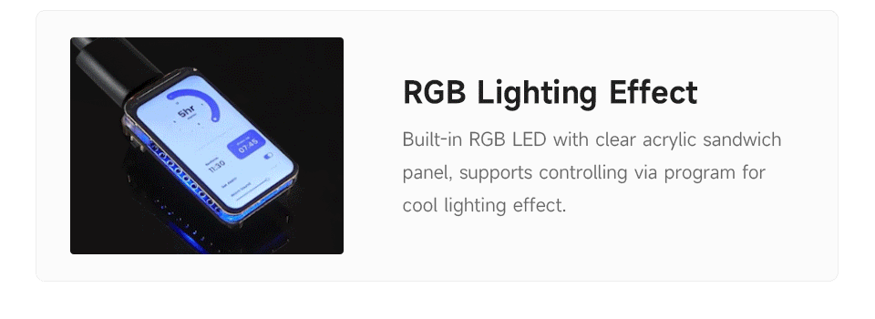
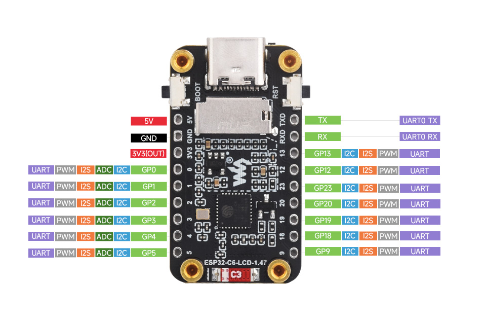
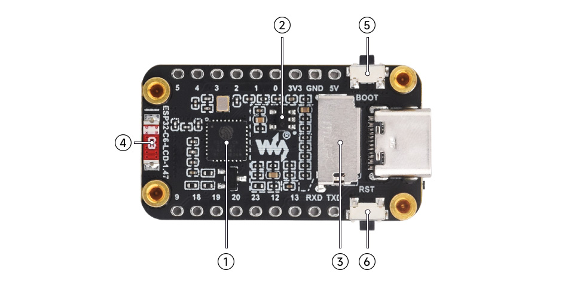
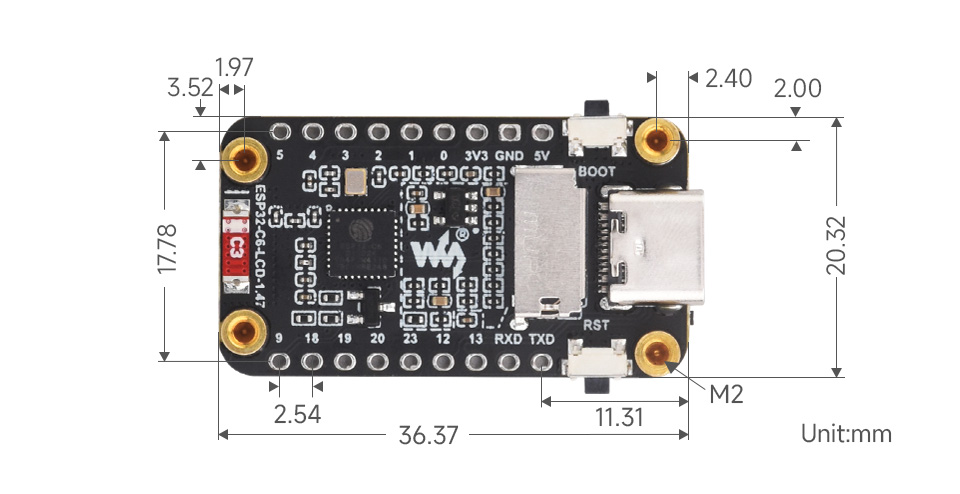

# ESP32-C6-LCD-1.47

## Table of Contents
- [ESP32-C6-LCD-1.47](#esp32-c6-lcd-147)
  - [Table of Contents](#table-of-contents)
  - [Features](#features)
  - [Application Scenarios](#application-scenarios)
  - [Supports multiple peripherals](#supports-multiple-peripherals)
  - [What's On Board](#whats-on-board)
  - [Outline dimensions](#outline-dimensions)

<!-- Table of contents generated with markdown-toc
http://ecotrust-canada.github.io/markdown-toc/ -->

## Features

**ESP32-C6-LCD-1.47** is a microcontroller development board with 2.4GHz Wi-Fi 6 and Bluetooth BLE 5 support, integrates 4MB Flash. Onboard 1.47inch LCD screen can smoothly run GUI programs such as LVGL. Combined with various peripheral interfaces, suitable for the quick development of the HMI and other ESP32-C6 applications.

- Equipped with a high-performance 32-bit RISC-V processor with clock speed up to 160 MHz, and a low-power 32-bit RISC-V processor with clock speed up to 20MHz
- Supports 2.4GHz Wi-Fi 6 (802.11 b/g/n) and Bluetooth 5 (LE), with onboard antenna
- Built in 320KB ROM, 512KB of HP SRAM, 16KB LP SRAM and 4MB Flash memory
- Onboard 1.47inch LCD display, 172×320 resolution, 262K color
- dapting multiple IO interfaces, integrates full-speed USB port
- Onboard TF card slot for external TF card storage of pictures or files
- Supports accurate control such as flexible clock and multiple power modes to realize low power consumption in different scenarios
- Built-in RGB LED with clear acrylic sandwich panel for cool lighting effect

## Application Scenarios

## Supports multiple peripherals

Supports the expansion of multiple peripherals via GPIO header

## What's On Board

1. ESP32-C6FH4
2. ME6217C33M5G
3. Low dropout regulator, 800mA output (Max.)
4. TF card slot
5. Onboard ceramic antenna
6. BOOT button
7. RESET button

## Outline dimensions
