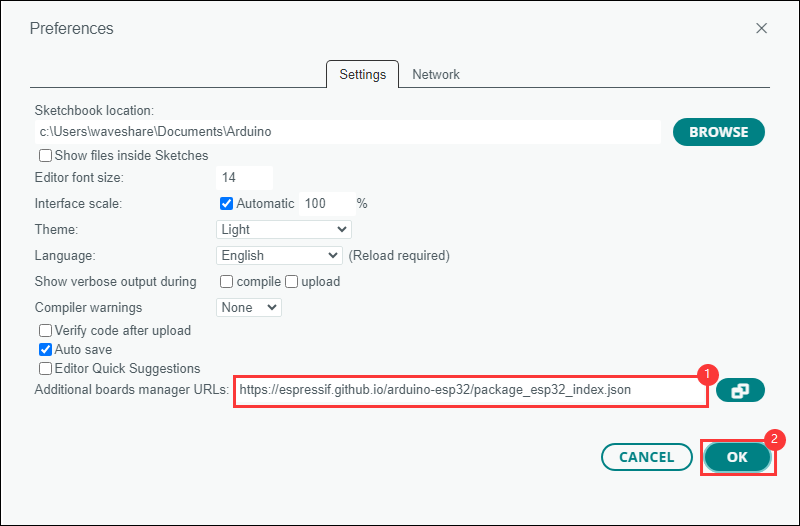
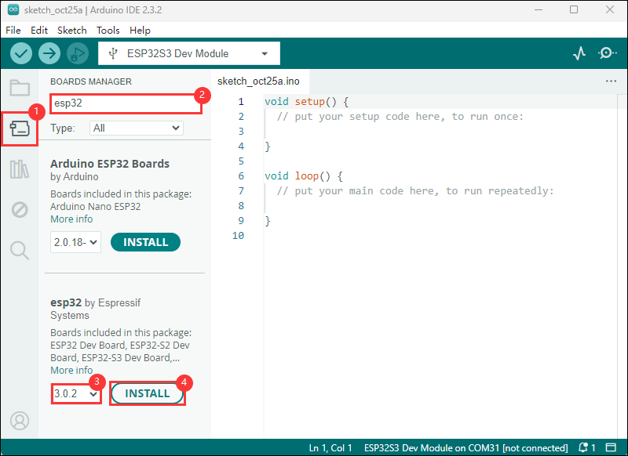
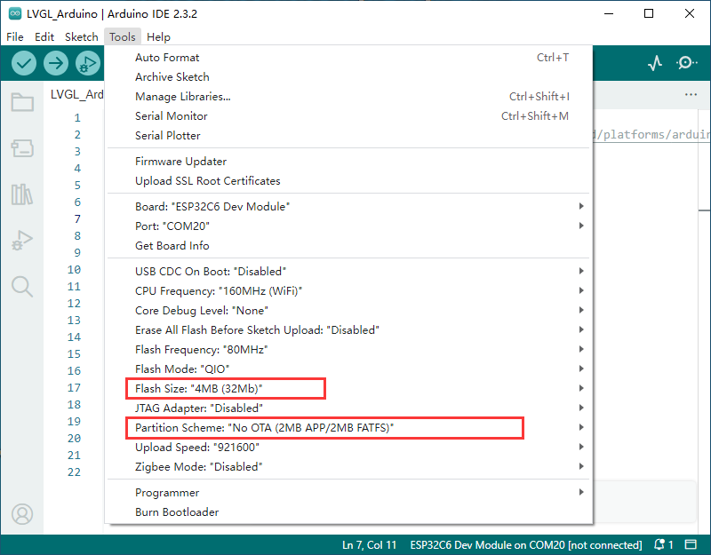

# esp32 c6 - LCD 1.47


## Documentation

- [Waveshare - esp32 c6 lcd 1.47 ](https://www.waveshare.com/esp32-c6-lcd-1.47.htm)
- [Wiki - Waveshare - esp32 c6 lcd 1.47 ](https://www.waveshare.com/wiki/ESP32-C6-LCD-1.47)
- [Board](ESP32-C6-LCD-1.47.md)
- [Schematic diagram](assets/doc/ESP32-C6-LCD-1.47_schemetics.pdf)
- [ESP32-C6 Technical Reference Manual](assets/doc/ESP32-C6_Technical_Reference_Manual.pdf)
- [ESP32-C6 Series Datasheet](assets/doc/ESP32-C6_Series_Datasheet.pdf)
- [1.47inch LCD Datasheet](assets/doc/1.47inch_LCD_Datasheet.pdf)
- [Demo](assets/demo/ESP32-C6-LCD-1.47-Demo.zip)
- [Exemple WaveShare](https://github.com/VolosR/WaveShareC6lvglexample)


## Table of Contents
- [esp32 c6 - LCD 1.47](#esp32-c6---lcd-147)
  - [Documentation](#documentation)
  - [Table of Contents](#table-of-contents)
  - [Development Tools](#development-tools)
  - [Requirements](#requirements)
  - [Installation](#installation)
  - [Contributing](#contributing)
  - [License](#license)

<!-- Table of contents generated with markdown-toc
http://ecotrust-canada.github.io/markdown-toc/ -->

## Development Tools
- [Arduino official website](https://www.arduino.cc/en/software/) or [Cloud Arduino](https://app.arduino.cc/)
- [LVGL](https://lvgl.io/) & [docs](https://docs.lvgl.io/master/index.html) & [tools EEZ Studio](https://www.envox.eu/studio/studio-introduction/)
- [Videao](https://www.youtube.com/watch?v=KEcr22qZAVE)

## Requirements

- Install Arduino Ide [link](https://www.arduino.cc/en/software/),
- Go to File --> Preferences --> Additional boards manager URLs: **https://espressif.github.io/arduino-esp32/package_esp32_index.json**,
  
- Install development board
    -  Select BOARDS MANAGER in the sidebar;
    -  Enter the name of the board you want to install ESP32 in the search box;
    -  Select Version Number in the box;
    -  Click INSTALL.
  
- Install library 
  - LVGL
  - PNGdec
  - [eez-framework](https://github.com/eez-open/eez-framework)
- Arduino project parameter setting
  

## Installation 

Directory:
- src\MiniTic\src\ui\MiniTic


```
Open MiniTic.ino
```

## Contributing

We welcome contributions of all kinds to this repository. For instructions on how to get started and
descriptions of our development workflows, please see our [contributing guide][contrib].

[contrib]: https://github.com/thanatos-vf-2000/esp32-c6-lcd-1.47/blob/main/CONTRIBUTING.md

## License

Copyright 2025 @Franck VANHOUCKE

Licensed under the Apache License, Version 2.0 (the "License"); you may not use this file except in compliance with the License. You may obtain a copy of the License at

http://www.apache.org/licenses/LICENSE-2.0
Unless required by applicable law or agreed to in writing, software distributed under the License is distributed on an "AS IS" BASIS, WITHOUT WARRANTIES OR CONDITIONS OF ANY KIND, either express or implied. See the License for the specific language governing permissions and limitations under the License.


For the full license text see [`LICENSE`](LICENSE).